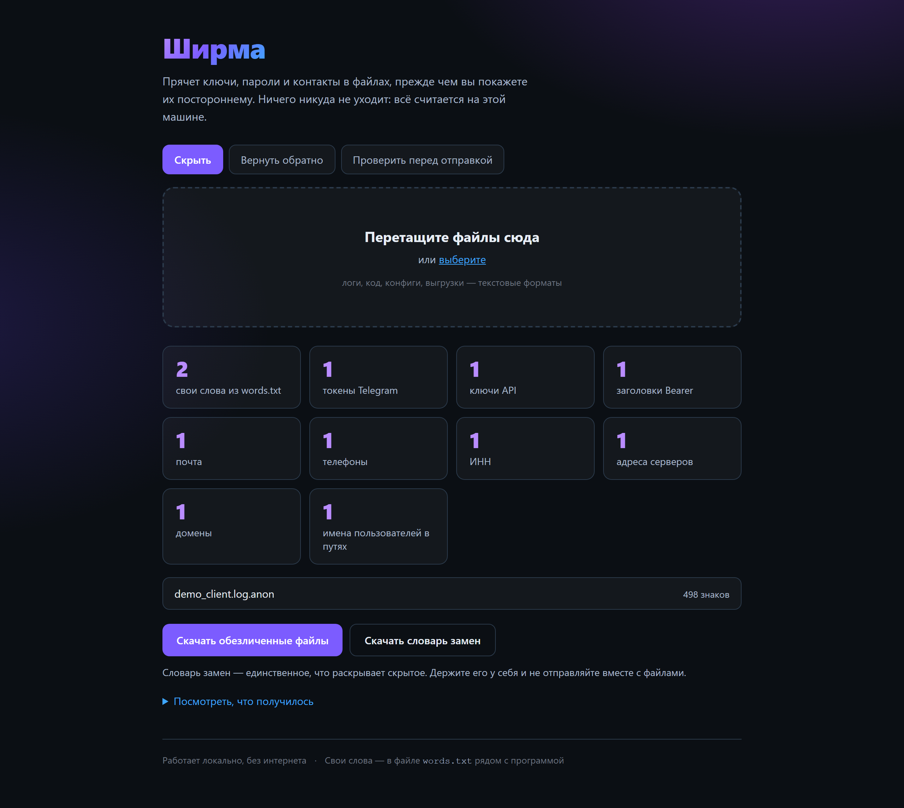
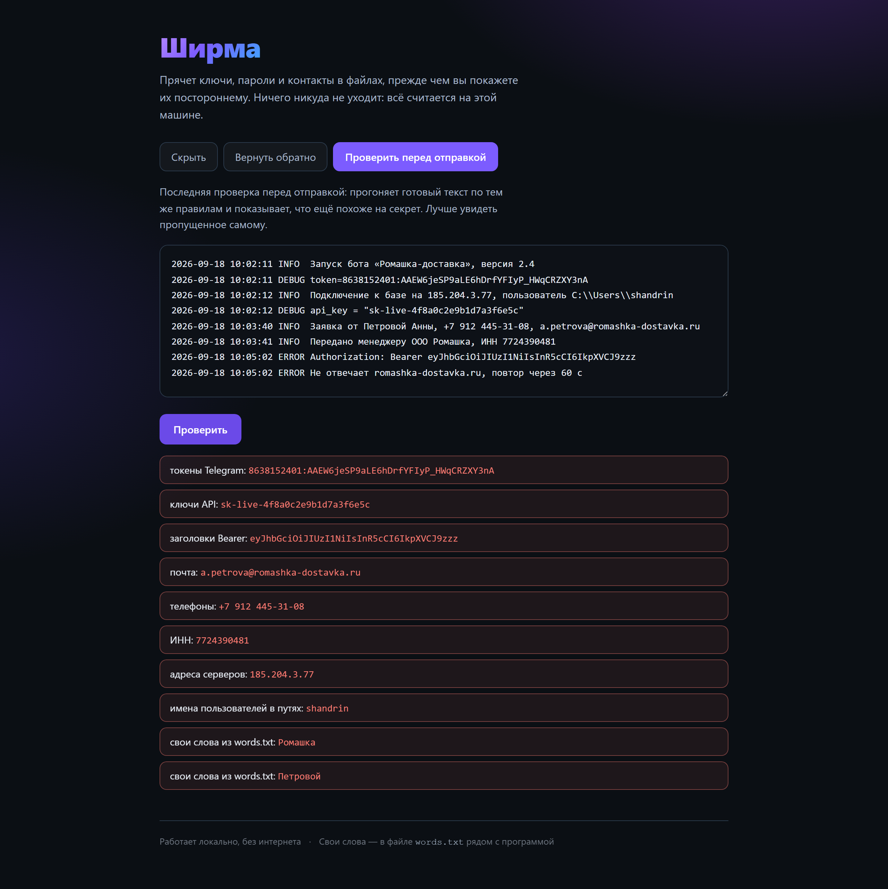
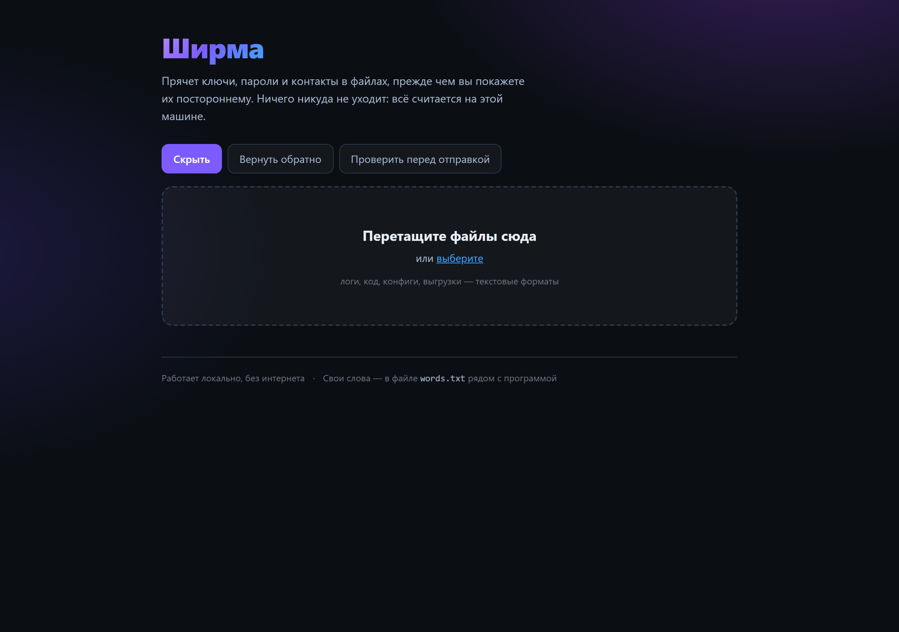

# Ширма

**Прячет ключи, пароли и контакты в файлах, прежде чем вы покажете их
постороннему. И возвращает всё обратно, когда ответ получен.**

Работает локально, без интернета и без единой внешней зависимости.
Нужен только Python 3.11 или новее.



---

## Зачем

Чтобы починить чужую программу, надо увидеть её логи, конфиги и код.
А в логах живут токены, пароли, телефоны, адреса серверов и фамилии
сотрудников. Отсюда тупик, который стоит денег обеим сторонам:

- заказчик не даёт доступ, потому что боится утечки, — и работа не начинается;
- либо даёт как есть, и его секреты расходятся по чужим ноутбукам и чатам.

Замазать всё звёздочками нельзя: вместе с секретами пропадут связи. Если
один и тот же ключ в десяти местах стал `***`, уже не понять, один это ключ
или десять разных и какой из них истёк.

**Ширма заменяет секреты устойчивыми метками.** Одна и та же компания везде
становится `NAME_1`, один и тот же ключ — `KEY_1`, в том числе в разных
файлах. Смысл и связи сохраняются, данные — нет.

## Как выглядит работа

Перетащили файлы — получили обезличенные копии, словарь замен и отчёт,
что именно скрыто. Было и стало:

```
до:     token=8638152401:AAEW6jeSP9aLE6hDrfYFIyP_HWqCRZXY3nA
        Подключение к базе на 185.204.3.77, пользователь C:\Users\shandrin
        api_key = "sk-live-4f8a0c2e9b1d7a3f6e5c"
        Заявка от Петровой Анны, +7 912 445-31-08, a.petrova@romashka-dostavka.ru
        Передано менеджеру ООО Ромашка, ИНН 7724390481

после:  token=TOKEN_1
        Подключение к базе на IP_1, пользователь C:\Users\USER_1
        api_key = "KEY_1"
        Заявка от NAME_2 Анны, PHONE_1, MAIL_1
        Передано менеджеру ООО NAME_1, ИНН INN_1
```

Структура лога цела, читать его можно, а секретов в нём нет.

## Пользовательский сценарий

1. **Записать свои слова.** Скопируйте `words.txt.example` в `words.txt`
   и впишите название компании и фамилии — шаблоном их не поймать.
   Падежи учитываются: «Петрова» поймает и «Петровой», и «Петрову».
2. **Обезличить.** Перетащить файлы на страницу или `python cli.py hide logs/`.
3. **Проверить перед отправкой.** Вкладка «Проверить» или
   `python cli.py check файл.anon` — покажет, что ещё похоже на секрет.
4. **Показать постороннему** обезличенную копию. Словарь замен остаётся
   у вас: только он раскрывает скрытое.
5. **Вернуть обратно.** Полученный ответ вставить во вкладку «Вернуть
   обратно» вместе со словарём — метки превратятся в настоящие значения.



## Запуск

```bash
git clone https://github.com/maksimgrishkov-sudo/anonymizer.git
cd anonymizer
python -m unittest discover tests     # 15 проверок
python app.py                         # откроется http://127.0.0.1:8765
```

```
...............
----------------------------------------------------------------------
Ran 15 tests in 0.006s

OK
```

Открывается вот это — три действия на одной странице:



Из командной строки, для папок и работы по SSH:

```bash
python cli.py hide logs/app.log             # рядом появится app.log.anon
python cli.py hide src/ --out anon_src/     # всю папку, метки сквозные
python cli.py check app.log.anon            # что осталось подозрительного
python cli.py back ответ.txt                # подставить настоящие значения
```

`check` возвращает ненулевой код, если что-то нашлось, — удобно ставить
в конвейер перед отправкой.

## Что умеет ловить

Токены Telegram, ключи вида `sk-…`, заголовки `Bearer` и `Basic`, пароли
и ключи в присваиваниях (`api_key = "…"`), почту, телефоны, ИНН, адреса
серверов, домены, имена пользователей в путях Windows и Linux — плюс свой
список слов для того, чего шаблоном не поймать.

Служебные адреса (`127.0.0.1`, `api.telegram.org` и подобные) остаются на
месте: без них обезличенный лог становится нечитаемым, а секрета в них нет.

## Устройство

```
anon/            ядро: правила и обезличивание
  patterns.py    что считать секретом
  core.py        метки, обратная подстановка, проверка
app.py           локальный веб-интерфейс (http.server)
cli.py           командная строка
static/          страница: HTML, CSS, JS — без фреймворков
tests/           15 проверок (unittest)
docs/            описание проекта и скриншоты
.claude/skills/  скилл для Claude Code
```

Ни одной внешней зависимости — это не педантизм. Через инструмент проходят
чужие секреты, и чем меньше постороннего кода в цепочке, тем меньше поводов
ему не верить. По той же причине сервер слушает только `127.0.0.1`,
а страница не делает ни одного внешнего запроса.

## Что нашлось при проверке на живом логе

Четыре дефекта, которых не было видно при чтении кода, — их поймала
проверка на настоящем файле, а не выдуманный пример:

| что было | чем грозило |
|---|---|
| шаблон пути ждал один слэш, а в логах Windows их два | имя пользователя уходило заказчику открытым |
| «Петрова» в списке не ловила «Петровой» | фамилия оставалась в файле |
| `words.txt` из Блокнота начинается с невидимой метки | первое слово списка не совпадало ни с чем |
| проверка считала секретом собственные метки | обезличенный файл вечно «грязный», предупреждениям перестаёшь верить |

Каждый закрыт тестом, чтобы не вернулся.

## Ограничения

- двоичные файлы (архивы, изображения, базы) пропускаются — секреты внутри
  них останутся;
- шаблоны ловят типовое; необычный формат ключа нужно добавить в
  `patterns.py`, а имена и названия — в `words.txt`;
- словарь замен не шифруется: он лежит рядом и защищён только тем, что
  остаётся у вас.

## Лицензия

MIT.
